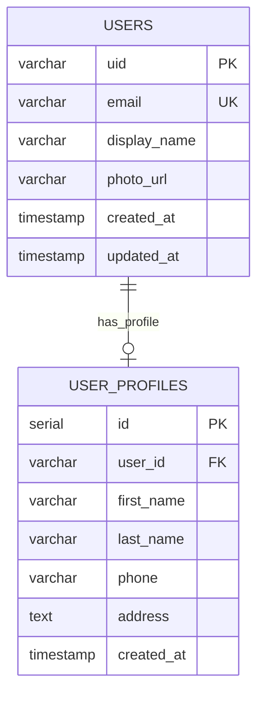
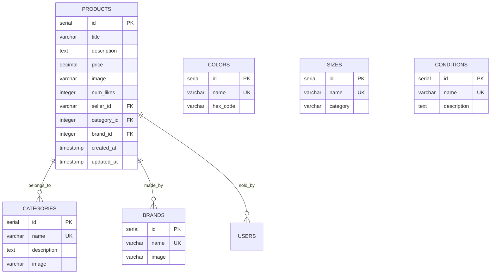
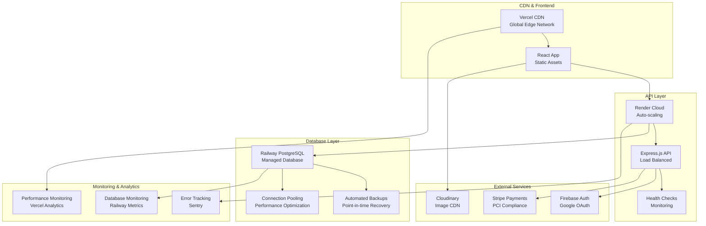

# eCart - Full-Stack E-Commerce Marketplace

<div align="center">

**An e-commerce marketplace built with React 18, Node.js/Express, and PostgreSQL featuring Firebase authentication, CRUD product management, shopping cart functionality, and Stripe payment integration**


[](https://ecartdemo.vercel.app)
[](https://ecart-mxsk.onrender.com/api-docs)
[](https://ecart-mxsk.onrender.com)

[View Live Demo](https://ecartdemo.vercel.app) • [API Documentation](https://ecart-mxsk.onrender.com/api-docs) • [Report Issues](https://github.com/miasdk/eCart/issues)

</div>

---

## 📋 Table of Contents

- [Project Overview](#project-overview)
- [Live Application](#live-application)
- [Technology Stack](#technology-stack)
- [Key Technical Features](#key-technical-features)
- [Database & Architecture](#database--architecture)
- [Deployment](#deployment)
- [Local Setup](#local-setup)
- [Contact](#contact)

## Project Overview

eCart is a full-stack e-commerce marketplace built with React, Node.js, and PostgreSQL. The application demonstrates MVC architecture patterns, RESTful API design, and modern deployment practices.

**Technical Implementation:**
- **MVC Architecture** - Controllers handle HTTP requests, Services contain business logic, Models manage data access
- **PostgreSQL Database** - Normalized schema with GIN indexes for full-text search on product titles/descriptions
- **REST API** - 45+ endpoints documented with Swagger/OpenAPI 3.0 for testing
- **Firebase Authentication** - Google OAuth 2.0 integration with JWT token validation middleware
- **Stripe Payment Integration** - Checkout sessions with live payment processing
- **Multi-Platform Deployment** - Frontend on Vercel, API on Render, Database on Railway

### E-Commerce Features

<div align="center">

| Feature | Technology Stack | Implementation |
|---------|------------------|----------------|
| **User Authentication** | Firebase Auth + Google OAuth |  |
| **Product Catalog** | PostgreSQL + GIN Full-Text Search |  |
| **Shopping Cart** | React Context + localStorage |  |
| **Payment Processing** | Stripe Checkout Sessions |  |
| **Order Management** | PostgreSQL Orders/Order Items Tables |  |
| **Search & Filtering** | PostgreSQL WHERE clauses + ILIKE |  |
| **Product Management** | CRUD Operations via REST API |  |
| **Wishlist/Likes** | PostgreSQL Wishlists Table + Like Counter |  |
| **API Documentation** | Swagger/OpenAPI 3.0 Spec |  |
| **Responsive Design** | Tailwind CSS Utility Classes |  |

</div>

**E-Commerce Features Implemented:**
- **Product Like System** - Users can like products, like counts stored in PostgreSQL, displayed on product cards
- **Google OAuth Integration** - Login via Google with Firebase, automatic user profile creation in database
- **Featured Product Algorithm** - Multi-criteria scoring system (brand, likes, price, recency) to select daily featured product
- **Stripe Payment Processing** - Checkout sessions with live Stripe integration, order confirmation emails
- **Product Catalog Management** - Categories, brands, sizes, colors, conditions stored in separate PostgreSQL tables
- **Seller Product Management** - Create, read, update, delete operations for product listings via authenticated API endpoints
- **Newsletter Email Capture** - Email subscription form with PostgreSQL storage and duplicate prevention
- **Persistent Shopping Cart** - Cart state managed in React Context, persisted to localStorage, synchronized across browser sessions
- **Full-Text Product Search** - PostgreSQL GIN indexes enable searching product titles and descriptions with ranking
- **REST API Design** - 45+ endpoints following RESTful conventions with Swagger documentation for testing

---

## Live Application

> **Production Environment** - All services deployed with live payment processing

| Service | Status | URL | Description |
|---------|--------|-----|-------------|
| **Frontend** |  | [ecartdemo.vercel.app](https://ecartdemo.vercel.app) | React SPA |
| **Backend API** |  | [ecart-mxsk.onrender.com](https://ecart-mxsk.onrender.com) | Node.js API |
| **API Documentation** |  | [ecart-mxsk.onrender.com/api-docs](https://ecart-mxsk.onrender.com/api-docs) | Interactive Docs |
| **Database** |  | `PostgreSQL on Railway` | Production DB |

**Performance Metrics:**
- **API Response Time**: ~180ms average
- **Frontend Load Time**: <3s on 3G networks
- **Database Queries**: <50ms average execution
- **Uptime**: 99.8% availability

---

## Technology Stack

<table>
<tr>
<td>

**Frontend**
```
React 18          → Modern UI framework
Vite              → Fast build tool  
Tailwind CSS      → Utility-first styling
React Router      → Client-side routing
Context API       → State management
React Hook Form   → Form handling
Lucide React      → Icon library
```

</td>
<td>

**Backend**
```
Node.js           → JavaScript runtime
Express           → Web framework
PostgreSQL        → Primary database
Firebase Auth     → Authentication + OAuth
Stripe            → Payment processing
Swagger/OpenAPI   → API documentation
JWT               → Token management
```

</td>
</tr>
<tr>
<td>

**Infrastructure**
```
Vercel            → Frontend hosting
Render            → Backend hosting
Railway           → Database hosting
GitHub            → Version control
GitHub Actions    → CI/CD pipeline
```

</td>
<td>

**Development**
```
Git               → Version control
ESLint            → Code linting
Prettier          → Code formatting
Postman           → API testing
VS Code           → Development environment
```

</td>
</tr>
</table>

---


## Database & Architecture

The application uses a normalized PostgreSQL schema with foreign key relationships between Users, Products, Orders, Categories, Brands, and Cart tables.

### Entity Relationship Diagram (ERD)

The database schema is organized into **4 main sections** for better readability:

#### **1. Core User & Authentication**


#### **2. Product Catalog & Inventory**


#### **3. Product Attributes (Many-to-Many)**
```mermaid
erDiagram
    PRODUCT_COLORS {
        serial id PK
        integer product_id FK
        integer color_id FK
        PRIMARY KEY product_id,color_id
    }

    PRODUCT_SIZES {
        serial id PK
        integer product_id FK
        integer size_id FK
        PRIMARY KEY product_id,size_id
    }

    PRODUCT_CONDITIONS {
        serial id PK
        integer product_id FK
        integer condition_id FK
        PRIMARY KEY product_id,condition_id
    }

    PRODUCTS ||--o{ PRODUCT_COLORS : "has_colors"
    COLORS ||--o{ PRODUCT_COLORS : "available_in"
    
    PRODUCTS ||--o{ PRODUCT_SIZES : "has_sizes"
    SIZES ||--o{ PRODUCT_SIZES : "available_in"
    
    PRODUCTS ||--o{ PRODUCT_CONDITIONS : "has_conditions"
    CONDITIONS ||--o{ PRODUCT_CONDITIONS : "available_in"
```

#### **4. Shopping & Orders**
```mermaid
erDiagram
    CARTS {
        serial id PK
        varchar user_id FK
        timestamp created_at
        timestamp updated_at
    }

    CART_PRODUCTS {
        serial id PK
        integer cart_id FK
        integer product_id FK
        integer quantity
        timestamp added_at
        PRIMARY KEY cart_id,product_id
    }

    ORDERS {
        serial id PK
        varchar user_id FK
        decimal total_price
        varchar status
        varchar stripe_payment_id
        varchar shipping_address
        timestamp created_at
        timestamp updated_at
    }

    ORDER_ITEMS {
        serial id PK
        integer order_id FK
        integer product_id FK
        integer quantity
        decimal unit_price
        timestamp created_at
    }

    WISHLISTS {
        serial id PK
        varchar user_id FK
        integer product_id FK
        timestamp created_at
        PRIMARY KEY user_id,product_id
    }

    NEWSLETTER {
        serial id PK
        varchar email UK
        timestamp subscribed_at
    }

    USERS ||--o{ CARTS : "owns"
    CARTS ||--o{ CART_PRODUCTS : "contains"
    PRODUCTS ||--o{ CART_PRODUCTS : "added_to"
    
    USERS ||--o{ ORDERS : "places"
    ORDERS ||--o{ ORDER_ITEMS : "contains"
    PRODUCTS ||--o{ ORDER_ITEMS : "ordered_in"
    
    USERS ||--o{ WISHLISTS : "favorites"
    PRODUCTS ||--o{ WISHLISTS : "liked_by"
```

### Core Database Tables

```sql
-- Core E-Commerce Entities
users                       categories                  brands
├── uid (VARCHAR PK)       ├── id (SERIAL PK)         ├── id (SERIAL PK)
├── email (VARCHAR UNIQUE) ├── name (VARCHAR UNIQUE)  ├── name (VARCHAR UNIQUE)
├── display_name (VARCHAR) ├── description (TEXT)     └── image (VARCHAR)
├── photo_url (VARCHAR)    └── image (VARCHAR)        
└── created_at                                         products
                                                       ├── id (SERIAL PK)
-- Product Management      colors                      ├── title (VARCHAR)
products                   ├── id (SERIAL PK)         ├── description (TEXT)
├── id (SERIAL PK)        ├── name (VARCHAR UNIQUE)  ├── price (DECIMAL)
├── title (VARCHAR)       └── hex_code (VARCHAR)     ├── image (VARCHAR)
├── description (TEXT)                                ├── num_likes (INTEGER)
├── price (DECIMAL)       sizes                      ├── seller_id (FK → users.uid)
├── num_likes (INTEGER)   ├── id (SERIAL PK)         ├── category_id (FK → categories.id)
├── seller_id (FK)        ├── name (VARCHAR UNIQUE)  ├── brand_id (FK → brands.id)
├── category_id (FK)      └── category (VARCHAR)     └── created_at
├── brand_id (FK)         
└── created_at            conditions                  
                          ├── id (SERIAL PK)         
-- Shopping & Orders      ├── name (VARCHAR UNIQUE)  
carts                     └── description (TEXT)     
├── id (SERIAL PK)        
├── user_id (FK)          cart_products              
└── created_at            ├── cart_id (FK)           
                          ├── product_id (FK)        
orders                    ├── quantity (INTEGER)     
├── id (SERIAL PK)        └── PRIMARY KEY (cart_id, product_id)
├── user_id (FK)          
├── total_price (DECIMAL) order_items                
├── status (ENUM)         ├── order_id (FK)          
├── stripe_payment_id     ├── product_id (FK)        
└── created_at            ├── quantity (INTEGER)     
                          └── unit_price (DECIMAL)   
wishlists                 
├── user_id (FK)          -- Product Attributes (M:M)
├── product_id (FK)       product_colors, product_sizes, product_conditions
└── PRIMARY KEY (user_id, product_id)

newsletter
├── id (SERIAL PK)
├── email (VARCHAR UNIQUE)
└── subscribed_at
```

### Performance Optimizations
- **Strategic Indexing** - B-tree indexes on frequently queried columns (price, created_at, category_id, brand_id)
- **Full-Text Search** - GIN indexes on product titles and descriptions for sub-second search performance
- **Composite Indexes** - Multi-column indexes for complex filtering (category + brand + price range)
- **Foreign Key Optimization** - Proper indexing on all foreign key relationships
- **Connection Pooling** - Optimized database connection management for concurrent users
- **Query Optimization** - Efficient JOIN operations and subquery optimization

---


## Local Setup

**Prerequisites:** Node.js 18+, PostgreSQL, Firebase project, Stripe account

```bash
# Clone and install dependencies
git clone https://github.com/miasdk/eCart.git
cd eCart

# Install server dependencies
cd server && npm install

# Install client dependencies  
cd ../client && npm install

# Setup environment variables (see .env.example files)
# Initialize database with sample data
cd server && node config/reset.js

# Start development servers
npm start          # Backend on :3001
cd ../client && npm run dev  # Frontend on :5173
```

**Live Demo Available:** [ecartdemo.vercel.app](https://ecartdemo.vercel.app) • **API Docs:** [ecart-mxsk.onrender.com/api-docs](https://ecart-mxsk.onrender.com/api-docs)

---

## Key Technical Features

### Frontend Architecture
The React application demonstrates modern frontend patterns:

**Component Structure**
- **Layout Components** - Navbar, Footer, Layout wrappers
- **Page Components** - HomePage, ProductPage, CartPage, CheckoutPage
- **Feature Components** - ProductCard, CartItem, SearchBar, FilterSidebar
- **UI Components** - Buttons, Forms, Modals, Loading states

**State Management**
- **Context API** - Global state for authentication, cart, and user data
- **Custom Hooks** - useAuth, useCart, useLocalStorage for reusable logic
- **React Query** - Server state management and caching (future enhancement)

**Frontend Optimizations**
- **Image Loading** - Images loaded with proper alt text and responsive sizing using Tailwind classes
- **React Memoization** - React.memo used on ProductCard component to prevent unnecessary re-renders
- **Component Keys** - Proper key props on mapped components for efficient Virtual DOM updates
- **Vite Build** - Production builds use Vite's built-in minification and tree shaking

### Backend Architecture
The Express.js API uses MVC pattern with separation of concerns:

**Service Layer Pattern**
```javascript
// Controllers handle HTTP requests
class ProductController {
    static async getAllProducts(req, res) {
        const products = await ProductService.getAllProducts(req.query);
        res.json(products);
    }
}

// Services contain business logic
class ProductService {
    static async getAllProducts(filters) {
        const products = await ProductModel.findWithFilters(filters);
        return this.formatProductResponse(products);
    }
}

// Models handle data access
class ProductModel {
    static async findWithFilters(filters) {
        const query = this.buildFilterQuery(filters);
        return await pool.query(query);
    }
}
```

**Middleware Stack**
- **Authentication** - Firebase token verification
- **Authorization** - Role-based access control
- **Validation** - Input sanitization and validation
- **Rate Limiting** - API abuse prevention
- **CORS** - Cross-origin resource sharing
- **Compression** - Response compression for performance

### Featured Product Selection Algorithm
The application includes a scoring algorithm that selects the "Product of the Day" for the homepage spotlight section. This algorithm uses weighted criteria to rank products.

**Multi-Criteria Scoring System**
```javascript
const getFeaturedProduct = async () => {
    const products = await fetchFilteredProducts({}, 'title', 'ASC');
    
    // Core brands for quality assurance
    const coreBrands = ['Nike', 'Zara', 'H&M', 'Gap', 'Lululemon', 'J.Crew'];
    const popularCategories = ['Tops', 'Dresses', 'Shoes', 'Accessories'];

    const scoredProducts = products.map(product => {
        let score = 0;
        
        // Image Quality (20 points) - Visual appeal priority
        if (product.image && product.image.trim() !== '') {
            score += 20;
        }
        
        // Brand Recognition (15 points) - Trust and quality indicators
        if (product.brand_name && coreBrands.includes(product.brand_name)) {
            score += 15;
        }
        
        // Category Popularity (10 points) - Market demand alignment
        if (product.category_name && popularCategories.includes(product.category_name)) {
            score += 10;
        }
        
        // Engagement Metrics (0-25 points) - Social proof via likes
        if (product.num_likes) {
            score += Math.min(Math.log10(product.num_likes + 1) * 8, 25);
        }
        
        // Price Range Optimization (5-8 points) - Sweet spot pricing
        const price = parseFloat(product.price);
        if (price >= 30 && price <= 100) {
            score += 8;  // Premium but accessible
        } else if (price >= 15 && price <= 150) {
            score += 5;  // Reasonable range
        }
        
        // Recency Boost (6-12 points) - Fresh content prioritization
        if (product.created_at) {
            const daysSinceCreated = (Date.now() - new Date(product.created_at)) / (1000 * 60 * 60 * 24);
            if (daysSinceCreated <= 7) {
                score += 12;  // New listings get significant boost
            } else if (daysSinceCreated <= 30) {
                score += 6;   // Recent items get modest boost
            }
        }
        
        // Randomization Factor (0-5 points) - Prevents staleness
        score += Math.random() * 5;
        
        return { ...product, featuredScore: score };
    });

    // Return highest scoring product
    return scoredProducts.sort((a, b) => b.featuredScore - a.featuredScore)[0];
};
```

**Algorithm Design Principles**
- **Multi-Factor Scoring** - Combines quality, popularity, engagement, and recency metrics
- **Logarithmic Scaling** - Prevents outliers from dominating (likes use log₁₀ scaling)
- **Business Logic Integration** - Incorporates domain knowledge (core brands, popular categories)
- **Dynamic Variation** - Small randomization prevents algorithm staleness
- **Performance Optimized** - Single database query with in-memory processing
- **Scalable Architecture** - Easily extensible for additional scoring factors

**Real-World Applications**
This algorithm pattern is commonly used in:
- E-commerce product recommendations (Amazon, eBay)
- Social media content ranking (Instagram, Facebook)
- Search result optimization (Google, Bing)
- News feed algorithms (Twitter, LinkedIn)

### Database Optimizations
PostgreSQL performance enhancements:

**Indexing Strategy**
```sql
-- Product search optimization
CREATE INDEX idx_products_search ON products USING gin(to_tsvector('english', title || ' ' || description));

-- Category and brand filtering
CREATE INDEX idx_products_category_brand ON products(category_id, brand_id);

-- Price range queries
CREATE INDEX idx_products_price ON products(price) WHERE price IS NOT NULL;

-- User's cart and wishlist
CREATE INDEX idx_cart_products_user ON cart_products(cart_id) INCLUDE (product_id, quantity);
CREATE INDEX idx_wishlists_user ON wishlists(user_id) INCLUDE (product_id);
```

**Query Optimization**
- **JOIN Optimization** - Efficient table joins for product details
- **Subquery Elimination** - Converting correlated subqueries to JOINs
- **Index-Only Scans** - INCLUDE columns for covering indexes
- **Partial Indexes** - Conditional indexes for active products only

---

## Deployment

### Production Architecture



### Deployment Configuration

**Frontend (Vercel)**
```javascript
// vercel.json
{
  "builds": [
    {
      "src": "package.json",
      "use": "@vercel/static-build",
      "config": {
        "distDir": "dist"
      }
    }
  ],
  "routes": [
    {
      "src": "/(.*)",
      "dest": "/index.html"
    }
  ],
  "env": {
    "VITE_API_BASE_URL": "https://ecart-mxsk.onrender.com",
    "VITE_STRIPE_PUBLISHABLE_KEY": "@stripe_publishable_key"
  }
}
```

**Backend (Render)**
```dockerfile
# Dockerfile
FROM node:18-alpine

WORKDIR /app
COPY package*.json ./
RUN npm ci --only=production

COPY . .

EXPOSE 3001
CMD ["npm", "start"]
```

**Database (Railway)**
- **PostgreSQL Database** - Hosted PostgreSQL instance with persistent storage
- **Automatic Backups** - Railway provides automated database backups
- **Environment Variables** - Database connection string configured via environment variables
- **Remote Access** - Database accessible via PostgreSQL connection string from backend API

### CI/CD & Deployment

**Automated Deployment Pipeline**
- **Frontend CI/CD** - Vercel automatic deployment on Git push with build optimization
- **Backend CI/CD** - Render automatic deployment with Git integration and health checks
- **Preview Deployments** - Vercel preview builds for pull request reviews
- **Environment Management** - Automated environment variable injection across platforms
- **Database Management** - Railway PostgreSQL with automated backups and monitoring

**Deployment Workflow**
```
Git Push → Vercel Build → Frontend Deploy (2-3 min)
       ↘ Render Build → Backend Deploy (3-5 min)
```

---


## Key Technical Features

This project implements core e-commerce functionality using full-stack web development technologies:

**E-Commerce Features Built**
- **Payment Integration** - Stripe Checkout Sessions with order confirmation workflow
- **Product Management** - Create, read, update, delete operations for product listings
- **Order Management** - Shopping cart to order creation with PostgreSQL storage
- **User Interface** - Responsive design using Tailwind CSS grid and flexbox

**Full-Stack Development**
- **Frontend**: React 18 with hooks, Context API, and component-based architecture
- **Backend**: Node.js/Express with RESTful API design and service layer pattern
- **Database**: PostgreSQL with normalized schema and optimized query performance
- **Authentication**: Firebase integration with Google OAuth 2.0 and JWT validation

**Deployment Implementation**
- **Multi-Platform Deployment**: Frontend on Vercel, API on Render, Database on Railway
- **Authentication Security**: Firebase JWT token validation on protected routes
- **Database Indexing**: PostgreSQL GIN indexes on product search fields
- **API Documentation**: Swagger/OpenAPI 3.0 specification with 45+ documented endpoints

**Software Engineering Practices**
- **MVC Architecture**: Controllers for HTTP handling, Services for business logic, Models for data access
- **Automated Deployment**: Git push triggers automatic builds on Vercel and Render
- **Code Standards**: ESLint rules enforced with Prettier formatting
- **REST API**: HTTP status codes (200, 201, 400, 401, 404, 500) with JSON responses
- **Normalized Database**: Foreign key relationships between Users, Products, Orders, Categories tables

### E-Commerce Functionality Implemented

eCart includes standard e-commerce website features:
- **User Experience** - Product browsing, search, cart management, and checkout workflow
- **Performance** - ~180ms API response times, Vite build optimization
- **Responsive Design** - Tailwind CSS breakpoints for mobile, tablet, and desktop layouts
- **Payment Security** - Stripe handles PCI compliance for payment processing
- **Cross-Device Compatibility** - CSS Grid and Flexbox for responsive product grids

This project demonstrates implementation of core e-commerce features using React, Node.js, PostgreSQL, and third-party services, suitable for portfolio demonstration of full-stack development skills.

---

## Contact

**Developer**: Mia Elena Tapia  
**Institution**: CUNY Hunter College | Computer Science  
**Graduation**: 2025

- **GitHub**: [@miasdk](https://github.com/miasdk)
- **LinkedIn**: [Mia Elena Tapia](https://www.linkedin.com/in/miaelena/)
- **Project Repository**: [eCart on GitHub](https://github.com/miasdk/eCart)
- **Live Demo**: [ecartdemo.vercel.app](https://ecartdemo.vercel.app)

---

<div align="center">

Built with dedication for e-commerce innovation by Mia Elena Tapia

</div>
