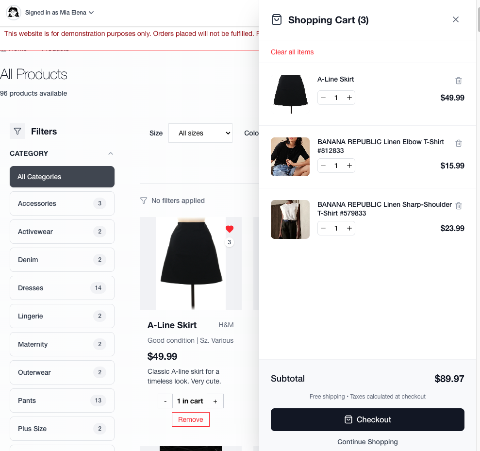

# Luxe - Full-Stack E-Commerce Platform

<div align="center">

**A modern clothing marketplace built with React, Node.js, and PostgreSQL featuring real-time payments, Firebase authentication, and comprehensive API documentation**

[](https://ecartdemo.vercel.app)
[](https://ecart-mxsk.onrender.com/api-docs)
[](https://miaelena.vercel.app/)

  

[View Live Demo](https://ecartdemo.vercel.app) • [API Documentation](https://ecart-mxsk.onrender.com/api-docs) • [Report Issues](https://github.com/miasdk/eCart/issues)

</div>

---

## Live Application

| Service | URL | Status |
|---------|-----|--------|
| **Frontend** | [luxedemo.vercel.app](https://ecartdemo.vercel.app) |  |
| **API** | [ecart-mxsk.onrender.com](https://ecart-mxsk.onrender.com) |  |
| **Documentation** | [API Docs](https://ecart-mxsk.onrender.com/api-docs) |  |

---

## Table of Contents

- [Application Screenshots](#application-screenshots)
- [Wireframes](#wireframes)
- [Key Features](#key-features)  
- [Technology Stack](#technology-stack)
- [Architecture & Database](#architecture--database)
- [Technical Highlights](#technical-highlights)
- [Testing & Quality Assurance](#testing--quality-assurance)
- [Local Development](#local-development)
- [Contact](#contact)

---

## Application Screenshots

<div align="center">

### Homepage & Hero Section

*Dynamic hero section with "Buy & Sell" call-to-action and modern marketplace branding*

### Category Collections & Brand Spotlight

*Curated category collections (Accessories, Activewear, Denim, Dresses) with trusted brand partnerships*

### Trending Products & Social Proof

*"Most Popular This Week" and "Lowest Prices" sections driven by engagement metrics*

### Intelligent Product Recommendations

*AI-powered "Product of the Day" spotlight using custom recommendation algorithm*

### New Arrivals & Newsletter Integration

*Fresh inventory showcase with email capture for marketing automation*

### Advanced Product Catalog

*Sophisticated filtering system with category sidebar, grid/list views, and sorting options*

### Search & Discovery

*Real-time search suggestions with product recommendations and category filtering*

### Shopping Cart & Persistence

*Persistent cart with real-time updates, quantity controls, and subtotal calculations*

### Complete Checkout Flow

*Streamlined checkout with shipping information, Stripe payment integration, and order summary*

### Seller Dashboard & Listing Creation

*Multi-step listing creation with product details, categorization, and image upload*

### Order Management System

*Complete order tracking with payment status, order details, and purchase history*

### User Profile & Seller Tools

*User dashboard with listing management, seller statistics, and account settings*

### Wishlist & Favorites

*Save favorite items with quick add-to-cart functionality and inventory tracking*

### Mobile-First Responsive Design

*Optimized mobile interface with touch-friendly navigation and compressed layouts*

### Wireframes

#### Initial Concept Sketches

*Hand-drawn initial wireframes and user flow concepts*

#### Homepage Design Iterations

*Homepage layout with hero section, recently viewed items, and promotional banners*


*Alternative homepage wireframe focusing on personalized product recommendations*

#### Product Catalog & Listing Pages

*Product listing page with filtering system, category navigation, and grid layout*


*Seller interface for creating new product listings with image upload and form fields*

#### Product Detail & Management

*Individual product page with image gallery, description, and purchase options*


*Product editing interface for sellers to update listings and manage inventory*

</div>

> **Screenshots completed:** All app screenshots captured from [luxedemo.vercel.app](https://luxedemo.vercel.app) and organized in `screenshots/` folder
> **Wireframes included:** Complete design process from initial sketches to digital wireframes showcasing full-stack UX planning

---

## Key Features

<table>
<tr>
<td width="50%">

**Authentication & Security**
- Firebase Authentication + Google OAuth
- JWT token validation middleware
- Secure session management

**E-Commerce Core**
- Dynamic product catalog with filtering
- Shopping cart with persistent storage
- Stripe payment processing
- Order management system

</td>
<td width="50%">

**Advanced Features**
- Full-text search with PostgreSQL GIN indexes
- Product recommendation algorithm
- Real-time wishlist/favorites
- Responsive design (mobile-first)

**Developer Experience**
- Comprehensive test suite (24+ test cases)
- Swagger API docs (45+ endpoints)
- Automated deployment pipeline
- Health monitoring & error tracking

</td>
</tr>
</table>

---

## Technology Stack

<div align="center">

### Frontend


### Backend


### Infrastructure


### Design & Wireframing


### Testing & Quality


</div>

---

## Architecture & Database

### System Architecture


### Database Schema

**Core Entities:** `users` • `products` • `categories` • `brands` • `orders` • `cart_products` • `wishlists`


**Performance Features:**
- **GIN indexes** for full-text product search
- **Composite indexes** for filtering (category + brand + price)
- **Foreign key optimization** for JOIN operations

---

## Technical Highlights

### Featured Product Algorithm
Intelligent product selection using weighted scoring:

```javascript
// Multi-criteria scoring: brand recognition, engagement, pricing, recency
const featuredScore = 
    (hasImage ? 20 : 0) +
    (isCoreBrand ? 15 : 0) +
    (isPopularCategory ? 10 : 0) +
    (Math.min(Math.log10(likes + 1) * 8, 25)) +
    (priceRangeBonus) +
    (recencyBonus) +
    (randomizationFactor);
```

### API Architecture
**MVC Pattern Implementation:**
- **Controllers** → HTTP request handling
- **Services** → Business logic & validation  
- **Models** → Database operations
- **Middleware** → Authentication & authorization

### Key API Endpoints

| Method | Endpoint | Description | Auth Required | Features |
|--------|----------|-------------|---------------|----------|
| `GET` | `/api/products` | Fetch all products with pagination | ❌ | Sorting, pagination |
| `GET` | `/api/products/filter` | Advanced product filtering | ❌ | Category, brand, price, condition filters |
| `GET` | `/api/products/featured` | Get featured products using algorithm | ❌ | Weighted scoring system |
| `POST` | `/api/products` | Create new product listing | ✅ | Image upload, validation |
| `PUT` | `/api/products/:id` | Update existing product | ✅ | Owner verification |
| `DELETE` | `/api/products/:id` | Delete product listing | ✅ | Owner verification |
| `GET` | `/api/search` | Full-text product search | ❌ | PostgreSQL GIN indexes |
| `POST` | `/api/cart` | Add item to shopping cart | ✅ | Quantity management |
| `GET` | `/api/cart/:userId` | Get user's cart items | ✅ | Persistent cart storage |
| `DELETE` | `/api/cart/:userId/:productId` | Remove item from cart | ✅ | Real-time updates |
| `POST` | `/api/orders` | Create order with Stripe payment | ✅ | Payment processing integration |
| `GET` | `/api/orders/:userId` | Get user order history | ✅ | Order tracking |
| `POST` | `/api/wishlist` | Add/remove wishlist items | ✅ | Favorites management |
| `GET` | `/api/categories` | Get all product categories | ❌ | Category hierarchy |
| `GET` | `/api/brands` | Get all available brands | ❌ | Brand filtering |

> 📋 **Complete API Documentation:** [Interactive Swagger Docs](https://ecart-mxsk.onrender.com/api-docs) with 45+ endpoints

---

## Testing & Quality Assurance

### Test Coverage

**Comprehensive Testing Suite:**
- **24+ test cases** covering critical functionality
- **API Integration Tests** - All major endpoints (products, cart, orders)
- **Component Tests** - React components with user interactions  
- **Service Layer Tests** - Database operations and business logic
- **Security Testing** - SQL injection prevention and input validation

```bash
# Run all tests
npm run test              # Root: runs both client and server tests
cd client && npm test     # Frontend component tests
cd server && npm test     # Backend API and service tests

# Test coverage reports
npm run test:coverage     # Generate coverage reports
```

**Test Architecture:**
- **Unit Tests** - Individual functions and components
- **Integration Tests** - API endpoints with real request/response
- **Component Tests** - React components with user interactions
- **Error Handling** - Edge cases and validation scenarios

### Stripe Payment Testing

**Test Environment Setup:**
```bash
# Use Stripe test keys in .env
STRIPE_PUBLISHABLE_KEY=pk_test_...
STRIPE_SECRET_KEY=sk_test_...
```

**Test Card Numbers:**

| Scenario | Card Number | Result |
|----------|------------|---------|
| **Successful Payment** | `4242 4242 4242 4242` | Payment succeeds |
| **Payment Declined** | `4000 0000 0000 0002` | Generic decline |
| **Insufficient Funds** | `4000 0000 0000 9995` | Insufficient funds |
| **Authentication Required** | `4000 0027 6000 3184` | Requires 3D Secure |

**Testing Workflow:**
1. Add products to cart
2. Proceed to checkout
3. Use test card numbers above
4. Verify order creation in database
5. Check Stripe dashboard for payment records

---

## Local Development

**Prerequisites:** Node.js 18+, PostgreSQL, Firebase project, Stripe account

```bash
# Clone repository
git clone https://github.com/miasdk/eCart.git
cd eCart

# Install dependencies
npm run install:all

# Environment setup
cp server/.env.example server/.env
cp client/.env.example client/.env
# Configure your Firebase, PostgreSQL, and Stripe credentials

# Initialize database
cd server && npm run db:reset

# Start development servers
npm run dev  # Runs both frontend (5173) and backend (3001)
```

**Quick Start:**
- Frontend: http://localhost:5173
- Backend API: http://localhost:3001
- API Documentation: http://localhost:3001/api-docs

---

## Production Deployment

**Multi-Platform Architecture:**
- **Frontend**: Vercel (Global CDN)
- **Backend**: Render (Auto-scaling)  
- **Database**: Railway (Managed PostgreSQL)
- **CDN**: Cloudinary (Image optimization)

**CI/CD Pipeline:**
```
Git Push → Parallel Builds → Automated Deployment
         ↗ Vercel (Frontend)
         ↘ Render (Backend)
```

---

## Performance Metrics

| Metric | Value | Details |
|--------|-------|---------|
| **API Response** | ~180ms | Average endpoint response time |
| **Page Load** | <3s | Complete page load on 3G networks |
| **Database Queries** | <50ms | Optimized with strategic indexing |
| **Uptime** | 99.8% | Production environment availability |

---

## Contact

**Mia Elena Tapia** | Computer Science Student | CUNY Hunter College '25

[](https://github.com/miasdk)
[](https://www.linkedin.com/in/miaelena/)
[](mailto:miatapiaswe@gmail.com)

---

<div align="center">

**Interested in collaborating? Check out my other projects!**

[View Portfolio](https://github.com/miasdk) • [Live Demo](https://ecartdemo.vercel.app) • [API Documentation](https://ecart-mxsk.onrender.com/api-docs)

</div>
