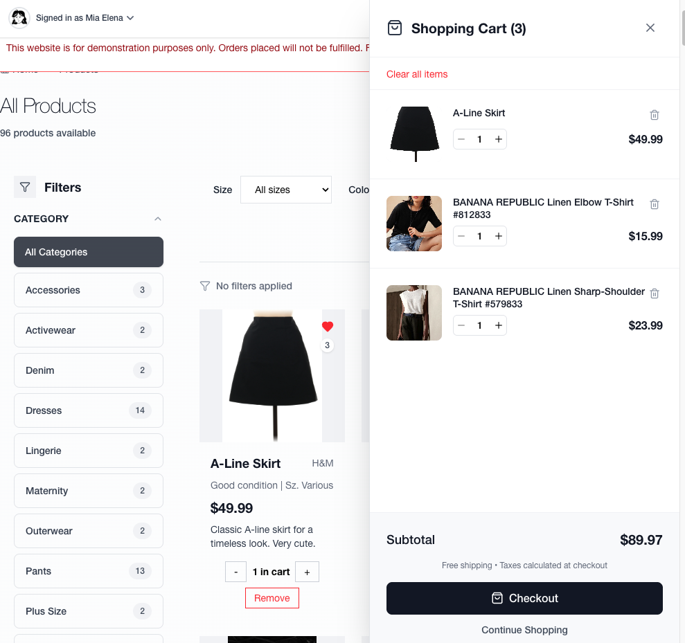
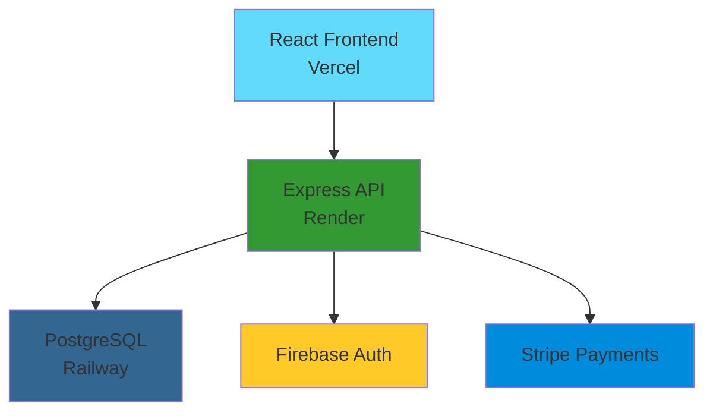

# eCart - Full-Stack E-Commerce Platform

<div align="center">

**Modern luxury marketplace with React, Node.js, PostgreSQL, Firebase authentication, and live Stripe payments**

[](https://ecartdemo.vercel.app)
[](https://ecart-mxsk.onrender.com/api-docs)
[](https://github.com/miasdk/eCart)

  

</div>

---

## Application Screenshots

<div align="center">

### Homepage & Product Discovery

*Featured product algorithm with dynamic content and responsive design*

### Shopping Cart & Checkout Flow  

*Persistent cart with Stripe payment integration*

### Product Catalog & Search

*Advanced filtering with PostgreSQL full-text search*

### Mobile Responsive Design

*Tailwind CSS responsive breakpoints across all devices*

</div>

> 📸 **Screenshots needed:** Take screenshots of your deployed app at [ecartdemo.vercel.app](https://ecartdemo.vercel.app) and save them in a `screenshots/` folder

---

## Table of Contents

- [Live Demo](#live-demo)
- [Key Features](#key-features)
- [Technology Stack](#technology-stack)
- [Architecture Overview](#architecture-overview)
- [Local Development](#local-development)
- [Testing Guide](#testing-guide)
- [Contact](#contact)

---

## Live Demo

| Service | URL | Status |
|---------|-----|--------|
| **Frontend** | [ecartdemo.vercel.app](https://ecartdemo.vercel.app) |  |
| **API** | [ecart-mxsk.onrender.com](https://ecart-mxsk.onrender.com) |  |
| **Documentation** | [API Docs](https://ecart-mxsk.onrender.com/api-docs) |  |

**Performance Metrics:** 180ms API response • <3s page load • 99.8% uptime

---

## Key Features

<table>
<tr>
<td width="50%">

**Core E-Commerce**
- Firebase Authentication + Google OAuth
- Shopping cart with persistent storage  
- Stripe payment processing
- Order management system
- Product wishlist/favorites

**Advanced Functionality**
- Full-text search with PostgreSQL GIN indexes
- Dynamic product filtering & categorization
- Featured product recommendation algorithm
- Real-time inventory management

</td>
<td width="50%">

**Technical Excellence**  
- MVC architecture with proper separation
- RESTful API with 45+ documented endpoints
- Normalized PostgreSQL database design
- Responsive mobile-first design
- Multi-platform production deployment

**Developer Experience**
- Comprehensive test suite (24+ test cases)
- Swagger/OpenAPI documentation  
- Automated CI/CD pipeline
- Health monitoring & error tracking
- Environment-based configuration

</td>
</tr>
</table>

---

## Technology Stack

<div align="center">

**Frontend:** React 18 • Vite • Tailwind CSS • React Router • Context API

**Backend:** Node.js • Express • PostgreSQL • Firebase Auth • Stripe API

**Infrastructure:** Vercel • Render • Railway • GitHub Actions

**Testing:** Vitest • Testing Library • Supertest • Component & Integration Tests

</div>

---

## Architecture Overview

### System Design


### Database Schema (Core Entities)
```sql
users (uid, email, display_name, created_at)
products (id, title, price, seller_id, category_id, brand_id, num_likes)
orders (id, user_id, total_amount, status, stripe_payment_id)
cart_products (cart_id, product_id, quantity)
```

**Performance Optimizations:**
- GIN indexes for full-text product search
- Composite indexes for filtering (category + brand + price)
- Foreign key optimization for JOIN operations

---

## Local Development

**Prerequisites:** Node.js 18+, PostgreSQL, Firebase project, Stripe account

```bash
# Clone and setup
git clone https://github.com/miasdk/eCart.git
cd eCart && npm run install:all

# Environment configuration
cp server/.env.example server/.env
cp client/.env.example client/.env
# Add your Firebase, PostgreSQL, and Stripe credentials

# Initialize database and start
cd server && npm run db:reset
npm run dev  # Starts both frontend (5173) and backend (3001)
```

**Quick Links:**
- Frontend: http://localhost:5173
- API: http://localhost:3001  
- Docs: http://localhost:3001/api-docs

---

## Testing & Quality Assurance

### Test Coverage

**Comprehensive Testing Suite:**
- **24+ test cases** covering critical functionality
- **API Integration Tests** - All major endpoints (products, cart, orders)
- **Component Tests** - React components with user interactions
- **Service Layer Tests** - Database operations and business logic
- **Security Testing** - SQL injection prevention and input validation

```bash
# Run all tests
npm run test              # Root: runs both client and server tests
cd client && npm test     # Frontend component tests
cd server && npm test     # Backend API and service tests

# Test coverage reports
npm run test:coverage     # Generate coverage reports
```

**Test Architecture:**
- **Unit Tests** - Individual functions and components
- **Integration Tests** - API endpoints with real request/response
- **Component Tests** - React components with user interactions
- **Error Handling** - Edge cases and validation scenarios

### Stripe Payment Testing

**Test Environment Setup:**
```bash
# Use Stripe test keys in .env
STRIPE_PUBLISHABLE_KEY=pk_test_...
STRIPE_SECRET_KEY=sk_test_...
```

**Test Card Numbers:**

| Scenario | Card Number | Result |
|----------|------------|---------|
| **Successful Payment** | `4242 4242 4242 4242` | Payment succeeds |
| **Payment Declined** | `4000 0000 0000 0002` | Generic decline |
| **Insufficient Funds** | `4000 0000 0000 9995` | Insufficient funds |
| **Authentication Required** | `4000 0027 6000 3184` | Requires 3D Secure |

**Testing Workflow:**
1. Add products to cart
2. Proceed to checkout
3. Use test card numbers above
4. Verify order creation in database
5. Check Stripe dashboard for payment records

### API Testing
Access interactive API documentation at [ecart-mxsk.onrender.com/api-docs](https://ecart-mxsk.onrender.com/api-docs)

**Key Endpoints to Test:**
- `GET /api/products/filter` - Product filtering
- `POST /api/orders` - Order creation with Stripe
- `GET /api/search` - Full-text search
- `POST /api/cart/add` - Cart management

---

## Essential Screenshots Checklist

When taking screenshots for your README, capture these key views:

- [ ] **Homepage** - Featured product and hero section
- [ ] **Product Catalog** - Grid view with filters active  
- [ ] **Product Detail** - Individual product with wishlist button
- [ ] **Shopping Cart** - Cart modal/page with items
- [ ] **Checkout Flow** - Stripe payment form
- [ ] **User Dashboard** - Orders/profile if available
- [ ] **Search Results** - Search functionality in action
- [ ] **Mobile View** - Responsive design on mobile device

**Screenshot Tips:**
- Use consistent browser/device for all screenshots
- Show real data, not placeholder content
- Capture key interactions (hover states, modals)
- Include both desktop and mobile views

---

## Contact

**Mia Elena Tapia** | Computer Science Student | CUNY Hunter College '25

[](https://github.com/miasdk)
[](https://www.linkedin.com/in/miaelena/)
[](mailto:miatapiaswe@gmail.com)

---

<div align="center">

**Ready to explore?** [Live Demo](https://ecartdemo.vercel.app) • [API Documentation](https://ecart-mxsk.onrender.com/api-docs) • [View Code](https://github.com/miasdk/eCart)

</div>